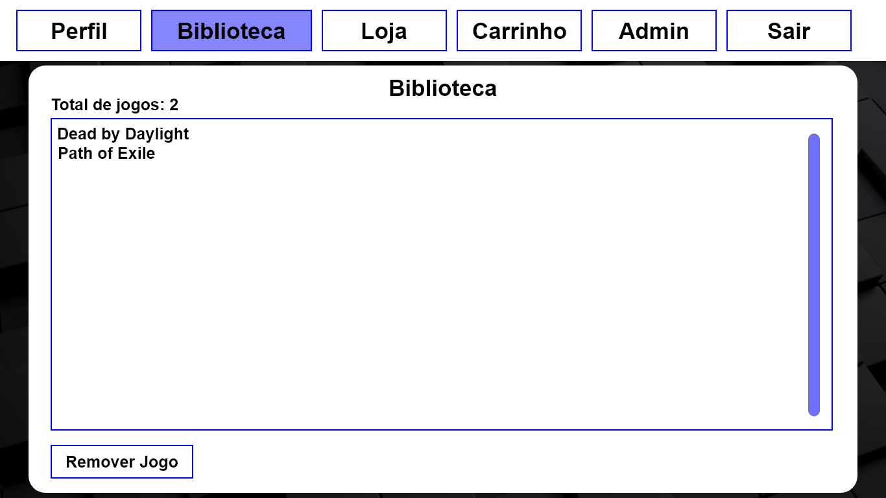

<h1 align="center">Loja de Jogos</h1>

Essa aplicação fornece um sistema básico de uma e-commerce, como a steam, com uma interface gráfica intuitiva.

 <a href="#objetivo">Objetivo</a> •
 <a href="#demonstração">Demonstração</a> • 
 <a href="#tecnologias">Tecnologias</a> • 
 <a href="#requisitos">Requisitos</a> • 
 <a href="#status-do-projeto">Status do Projeto</a> • 
 <a href="https://github.com/Samuelvidal99/ner-drugs-api/blob/main/LICENSE">Licença</a> • 
 <a href="#autores">Autor</a>

<h1>Objetivo</h1>
<p1>Essa aplicação foi desenvolvida como projeto avaliativo para a cadeira de Programação II na UFRPE (Universidade Federal Rural de Pernambuco), e teve como objetivo o aprendizado da linguagem de programação Java, o desenvolvimento de um sistema modularizado, o aprendizado do paradigma da Programação Orientação a Objeto (POO) e a utilização da biblioteca gráfica JavaFx.</p1>

<h1>Demonstração</h1>

<h1 align='center'></img>  </img></h1>

## Tecnologias

As seguintes ferramentas foram usadas na construção do projeto:

- [Java](https://www.java.com/pt-BR/)
- [JavaFx](https://openjfx.io)

<h1>Requisitos</h1>
<p1>Para utilizar essa aplicação basta possui uma versão do Java igual ou maior a 7.0 e possuir JavaFx versão 2.1.0 ou maior.</p1>

<h1>Status do Projeto</h1>
<h4>Finalizado :white_check_mark:</h4>

<h1>Autores</h1>
<a href="https://github.com/Samuelvidal99"><b>Samuel Vidal</b></a>  
Feito por <b>Samuel Vidal</b>, Entre em contato por: 

<a href="https://github.com/hudo9921"><b>Hudo Leonardo</b></a>  
Feito por <b>Hudo Leonardo</b>, Entre em contato por: 

